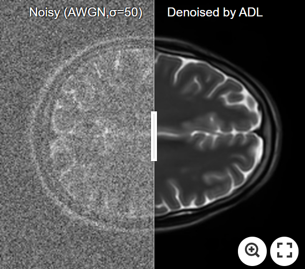
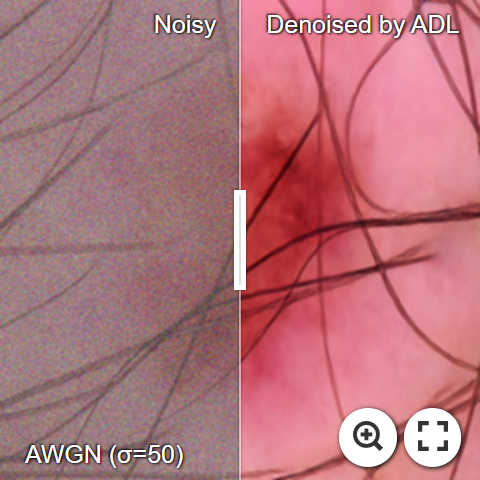
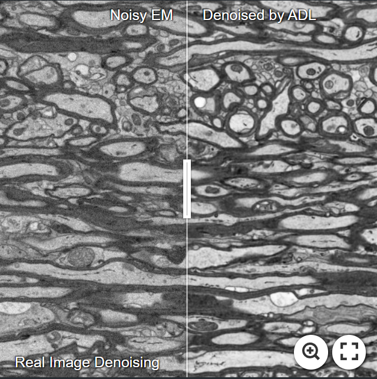
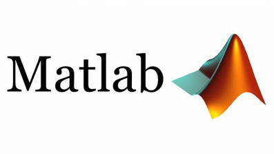

## ADL: Adversarial Distortion Learning for Denoising and Distortion Removal
<!-- [](https://github.com/mogvision/ADL/releases)  -->

<!--[Kai Zhang](https://cszn.github.io/) -->
[Morteza Ghahremani](https://scholar.google.com/citations?user=yhXUlXsAAAAJ), [Mohammad Khateri](https://scholar.google.com/citations?user=???) 

*[AiVi](https://www.uef.fi/en/unit/ai-virtanen-institute-for-molecular-sciences), UEF, Finland*

</a>  [](https://github.com/mogvision/ADL/LICENSE) [GET IT]

[](https://imgsli.com/OTM3OTI) [](https://imgsli.com/OTM3OTA) 
[](https://imgsli.com/OTM3ODE) [](https://imgsli.com/OTM3ODE)
_______
This repository is the official implementation of ADL: Adversarial Distortion Learning for denoising medical and computer vision images (arxiv, supp, pretrained models, visual results). 

[](https://github.com/mogvision/ADL/tree/main/TensorFlow) [](https://github.com/mogvision/ADL/tree/main/PyTorch) [](https://github.com/mogvision/ADL/tree/main/MATLAB) </a>


ADL achieves state-of-the-art Gaussian denoising performance in

- grayscale/color image denoising in Computer Vision and Medical imaging :fire::fire::fire:
- bicubic/lighweight/real-world image SR :fire::fire::fire:
- JPEG compression artifact reduction :fire::fire::fire:


Network architectures
----------
* [Efficient-UNet (Denoiser)](CITE PAPER HERE)

   
  
  
  
  
Good samples: https://github.com/facebookresearch/pytorch3d

https://github.com/tensorflow/tensorflow
<!---- **_News (2021-09-09)_**: Add [main_download_pretrained_models.py](https://github.com/cszn/KAIR/blob/master/main_download_pretrained_models.py) to download pre-trained models.. <<<<<<<<<<<<<<<<<<<<<<<<<<<<<<<<<<<<<<<<<<<<<<<<<<< -->
<!--- - **_News (2021-09-08)_**: Add [matlab code](https://github.com/cszn/KAIR/tree/master/matlab) to zoom local part of an image for the purpose of comparison between different results.. <<<<<<<<<<<<<<<<<<<<<<<<<<<<<<<<<<<<<<<<<<<<<<<<<<< -->
<!--- **_News (2021-12-23)_**: Our techniques are adopted in [https://www.amemori.ai/](https://www.amemori.ai/). <<<<<<<<<<<<<<<<<<<<<<<<<<<<<<<<<<<<<<<<<<<<<<<<<<< -->
<!--- **_News (2021-12-23)_**: Our new work for practical image denoising. <<<<<<<<<<<<<<<<<<<<<<<<<<<<<<<<<<<<<<<<<<<<<<<<<<< -->

# Denoising results on [BSD68](https://paperswithcode.com/dataset/bsd) and [CBSD68](https://paperswithcode.com/dataset/cbsd68):

## Results on the [BSD68](https://paperswithcode.com/dataset/bsd) dataset for Additive white Gaussian noise:

|  σ    | BM3D| WNNM | DnCNN  | NLRN | FOCNet | MWCNN | DRUNet | SwinIR | ADL (ours) |
|:-----:|:---:|:----:|:------:|:----:|:------:|:-----:|:------:|:------:|:----------:|
| 15 | 31.08 | 31.37 | 31.73  | 31.88  | 31.83 | 31.86 | 31.91 | 31.97 | :fire::fire: **33.55** :fire::fire:|
| 25 | 28.57 | 28.83 | 29.23  | 29.41  | 29.38 | 29.41 | 29.48 | 29.50 | :fire::fire: **31.23** :fire::fire:|
| 50 | 25.60 | 25.87 | 26.23  | 26.47  | 26.50 | 26.53 | 26.59 | 26.58 | :fire::fire: **28.11** :fire::fire:|

- [x] Here we reported the results of the techniques reported by the authors.
- [x] Our ADL was trained on the [Flickr2K](https://github.com/LimBee/NTIRE2017) dataset only!


## Results on the [CBSD68](https://paperswithcode.com/dataset/cbsd68) dataset for Additive white Gaussian noise:

| σ | BM3D | WNNM  | EPLL | MLP |  CSF | TNRD  | DnCNN | FDnCNN | DRUNet | SwinIR | ADL (ours) |
|:------:|:------:|:------:|:------:|:------:|:------:|:------:|:------:|:-------:|:------:|:------:|:------:|
| 15 | 33.52 | 33.90 | 33.86 | 33.87 | 33.91 |  -    | 34.10 |  -     | 34.30 | 34.42 | **dfdf** :fire:|
| 25 | 30.71 | 31.24 | 31.16 | 31.21 | 31.28 | 31.24 | 31.43 |  -     | 31.69 | 31.78 | **dfdf** :fire:|
| 50 | 27.38 | 27.95 | 27.86 | 27.96 | 28.05 | 28.06 | 28.16 | 28.31  | 28.51 | 28.56 | **dfdf** :fire:|


link: https://paperswithcode.com/sota/color-image-denoising-on-cbsd68-sigma50 

| CBSD68 (σ=50)| Noisy (σ=50) | SwinIR  | ADL (ours) |
|    :---      |     :---:    | :-----:|  :-----: | 
|  |  | ||
||||||


| Noise Level (σ) | BM3D |   DnCNN | FDnCNN | DRUNet | SwinIR | ADL (ours) |
|:------:|:------:|:------:|:------:|:------:|:------:|:------:|:------:|:-------:|:------:|:------:|:------:|


This repo contains training and testing codes for ADL

[](https://colab.research.google.com/github/googlecolab/colabtools/blob/master/notebooks/colab-github-demo.ipynb)


This repository is the official implementation of ADL: Adversarial Distortion Learning for denoising medical and computer vision images (arxiv, supp, pretrained models, visual results). ADL achieves state-of-the-art performance in

grayscale/color image denoising in Computer Vision and Medical imaging
bicubic/lighweight/real-world image SR
JPEG compression artifact reduction


<details>
<summary>Classical Image Super-Resolution (click me)</summary>
<p align="center">
  
  
</p>
</details>

https://jingyunliang.github.io/????????????????


<a href="url"></a>

# Requirements

* ....

MORE results: https://arxiv.org/pdf/2108.10257.pdf

color: SOTA: https://paperswithcode.com/sota/color-image-denoising-on-cbsd68-sigma50


Upload models here..........

_______
## Citation

If you find ADL useful in your research, please cite our tech report:

```bibtex
@article{?,
    author = { ? },
    title = {?D},
    journal = {arXiv:2007.08501},
    year = {?},
}
```

_______
Feel free to mail me for any doubts/query: morteza.ghahremani@uef.fi


