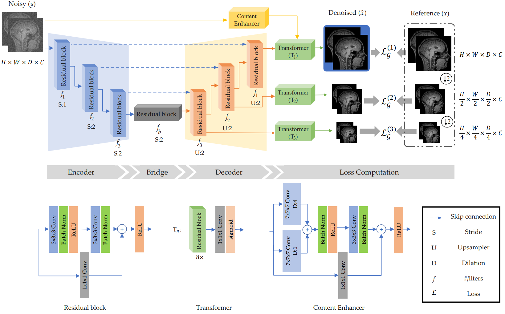
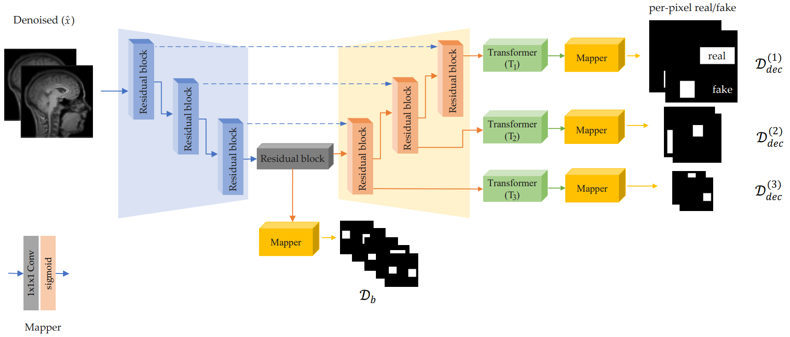
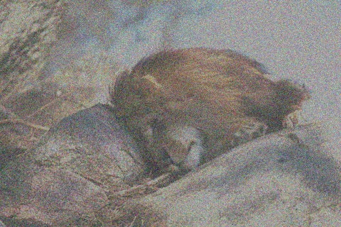
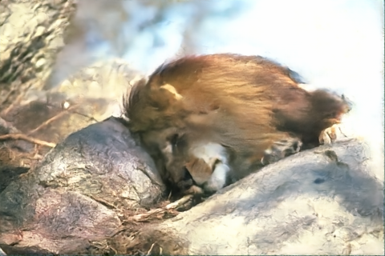
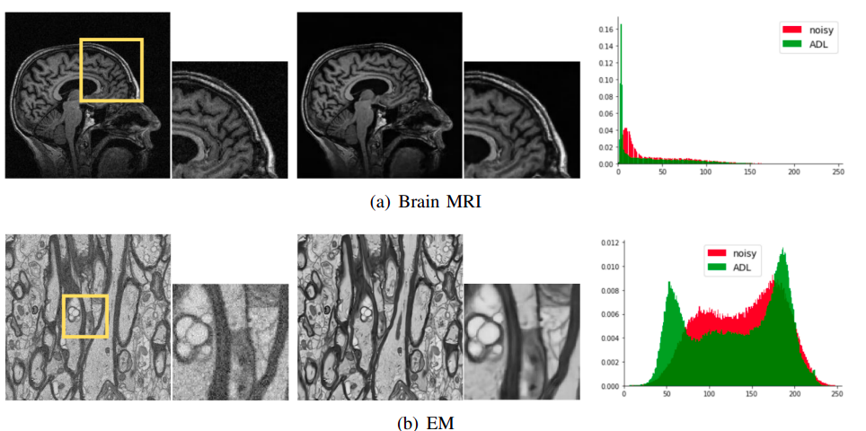

[](https://paperswithcode.com/sota/grayscale-image-denoising-on-bsd68-sigma15?p=adversarial-distortion-learning-for-medical)
[](https://paperswithcode.com/sota/grayscale-image-denoising-on-bsd68-sigma25?p=adversarial-distortion-learning-for-medical)
[](https://paperswithcode.com/sota/grayscale-image-denoising-on-bsd68-sigma50?p=adversarial-distortion-learning-for-medical)
[](https://paperswithcode.com/sota/color-image-denoising-on-cbsd68-sigma15?p=adversarial-distortion-learning-for-medical)
[](https://paperswithcode.com/sota/color-image-denoising-on-cbsd68-sigma25?p=adversarial-distortion-learning-for-medical)
[](https://paperswithcode.com/sota/color-image-denoising-on-cbsd68-sigma35?p=adversarial-distortion-learning-for-medical)
[](https://paperswithcode.com/sota/color-image-denoising-on-cbsd68-sigma50?p=adversarial-distortion-learning-for-medical)

<!--  https://paperswithcode.com/task/color-image-denoising -->

## ADL: Adversarial Distortion Learning for Denoising and Distortion Removal
<!-- [](https://github.com/mogvision/ADL/releases)  -->

<!--[Kai Zhang](https://cszn.github.io/) -->
[Morteza Ghahremani](https://scholar.google.com/citations?user=yhXUlXsAAAAJ), [Mohammad Khateri](https://scholar.google.com/citations?user=vHtGWmoAAAAJ&hl=en), [Alejandra Sierra](https://scholar.google.fi/citations?user=cxP2f78AAAAJ&hl=en), [Jussi Tohka](https://scholar.google.com/citations?user=StmRhaUAAAAJ&hl=en)


*[AiVi](https://www.uef.fi/en/unit/ai-virtanen-institute-for-molecular-sciences), UEF, Finland*


[](https://imgsli.com/OTM3OTI)
[](https://imgsli.com/OTM3OTA)
[](https://imgsli.com/OTM3ODE)
[](https://imgsli.com/MTAyNDQ4)

_______
This repository is the official implementation of ADL: Adversarial Distortion Learning for denoising medical and computer vision images ([arxiv](https://arxiv.org/abs/2204.14100), supp, pretrained models, visual results). 

| [TensorFlow ](https://github.com/mogvision/ADL/tree/main/TensorFlow) | [PyTorch  ](https://github.com/mogvision/ADL/tree/main/PyTorch) |  [</a> ](https://github.com/mogvision/ADL/blob/main/ADLdemo.ipynb) | 
|:---: |:---: |:---: |
<table align="center"></table>

\
ADL achieves state-of-the-art Gaussian denoising performance in

- grayscale/color image denoising in Medical imaging :fire::fire::fire:
- grayscale/color image denoising in Computer Vision images :fire::fire::fire:
- JPEG compression artifact reduction :fire::fire::fire:
- grayscale/color deblurring :fire::fire::fire:


Network architectures
----------
* Proposed Efficient-UNet (Denoiser)
 

* Proposed Efficient-UNet (Discriminator)
 
______________
 
# Denoising Results on [BSD68](https://paperswithcode.com/dataset/bsd) and [CBSD68](https://paperswithcode.com/dataset/cbsd68):

* Results on the [BSD68](https://paperswithcode.com/dataset/bsd) dataset for Additive white Gaussian noise:

|  σ    | BM3D| WNNM | DnCNN  | NLRN | FOCNet | MWCNN | DRUNet | SwinIR | ADL (ours) |
|:-----:|:---:|:----:|:------:|:----:|:------:|:-----:|:-----:|:-----:|:---------:|
| 15 | 31.08 | 31.37 | 31.73 | 31.88  | 31.83 | 31.86 | 31.91 | 31.97 | :fire: **32.11** :fire:|
| 25 | 28.57 | 28.83 | 29.23 | 29.41  | 29.38 | 29.41 | 29.48 | 29.50 | :fire: **29.50** :fire:|
| 50 | 25.60 | 25.87 | 26.23 | 26.47  | 26.50 | 26.53 | 26.59 | 26.58 | :fire: **26.87** :fire:|

- [x] Here we reported the results of the techniques reported by the authors.
- [x] Our ADL was trained on the grey [Flickr2K](https://github.com/LimBee/NTIRE2017) dataset only!

| CBSD68 (img_id: test015)| Noisy (σ=25) | SwinIR  | ADL (ours) |
|    :---      |     :---:    | :-----:|  :-----: | 
|  |  | |


* Results on the [CBSD68](https://paperswithcode.com/dataset/cbsd68) dataset for Additive white Gaussian noise:

| σ | BM3D | WNNM  | EPLL | MLP |  CSF | TNRD  | DnCNN  | DRUNet | SwinIR | ADL (ours) |
|:------:|:------:|:------:|:------:|:------:|:------:|:------:|:------:|:-------:|:------:|:------:|
| 15 | 33.52 | 33.90 | 33.86 | 33.87 | 33.91 |  -    | 34.10 | 34.30 | 34.42 | :fire: **34.61** :fire:|
| 25 | 30.71 | 31.24 | 31.16 | 31.21 | 31.28 | 31.24 | 31.43 | 31.69 | 31.78 | :fire: **32.18** :fire:|
| 50 | 27.38 | 27.95 | 27.86 | 27.96 | 28.05 | 28.06 | 28.16 | 28.51 | 28.56 | :fire: **29.02** :fire:|

| CBSD68 (img_id: test015)| Noisy (σ=50) | SwinIR  | ADL (ours) |
|    :---      |     :---:    | :-----:|  :-----: | 
|  |  | |


# Denoising Results on Medical Images:
<p align="center">

</p>
<details>
<summary> 2D (click here)</summary>
<p align="center">
  
   
</p>
</details>

<details>
<summary> 3D MRI Brain-BrainWeb (click here)</summary>
<p align="center">
  
  
</p>
</details>

<details>
<summary> 3D MRI knee-fastMRI (click here)</summary>
<p align="center">

 </p>
</details>


_______
## Citation

If you find ADL useful in your research, please cite our tech report:

```bibtex
@article{ADL2022,
    author = {Morteza Ghahremani, Mohammad Khateri, Alejandra Sierra, Jussi Tohka},
    title = {Adversarial Distortion Learning for Medical Image Denoising},
    journal = {arXiv:2204.14100},
    year = {2022},
}
```
